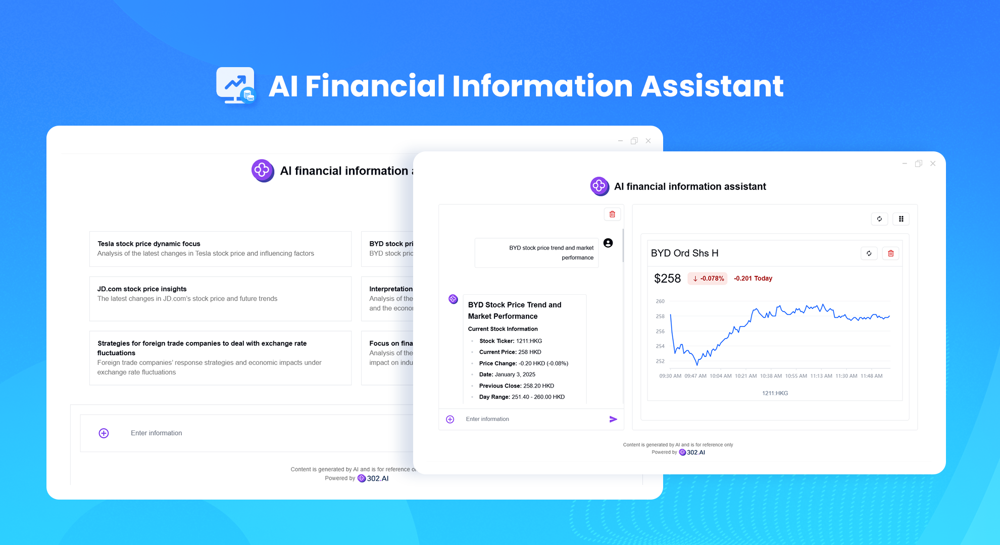
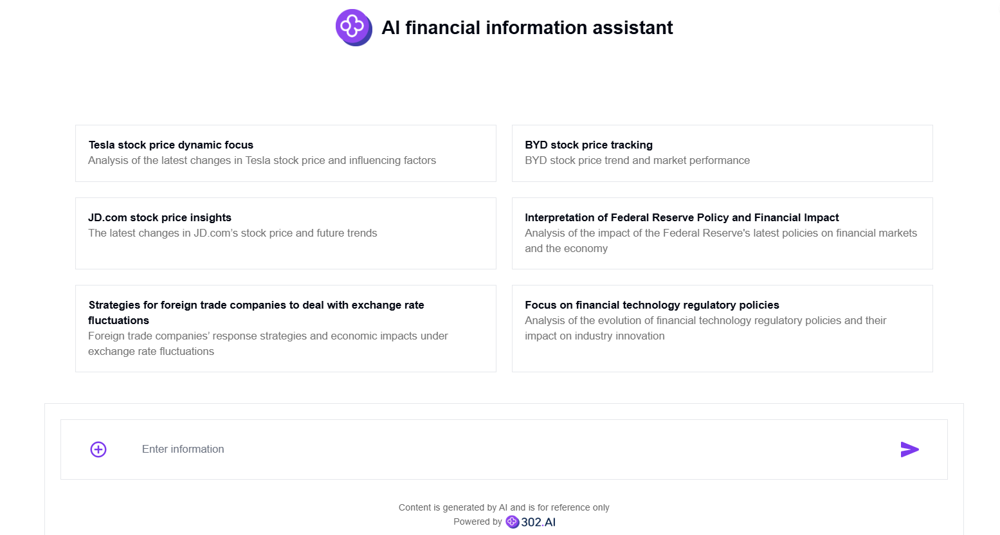
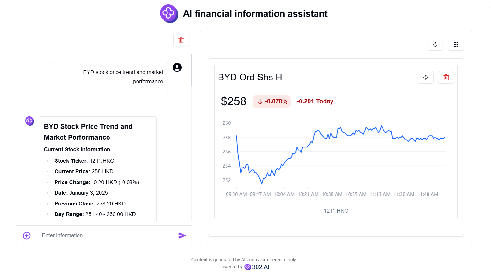

# 
📈 AI Financial Information Assistant 🚀✨

AI Financial Assistant can quickly and accurately obtain online financial information such as stocks and funds through chatting with AI, intelligently analyze data and information for users, and draw charts to display financial trends.

<a href="README_zh.md">中文</a> | <a href="README.md">English</a> | <a href="README_ja.md">日本語</a>

    

This is the open-source version of the [AI Financial Assistant](https://302.ai/en/tools/finance/) from [302.AI](https://302.ai/en/).
You can directly log in to 302.AI and use the online version with zero code and zero configuration.
Alternatively, you can modify this project according to your needs, input 302.AI's API KEY, and deploy it yourself.

## Interface Preview
Enter the financial information you want to query on the homepage.

Based on the information from the conversation with AI, generate corresponding charts on the right side, which can be refreshed to obtain real-time chart information.

## 📐 Project Features
- Intelligent Query: AI automatically selects the most suitable tools to query financial information based on user input.
- Real-time Stock Market Charts: Automatically renders intuitive stock market trend charts based on queried data.
- User-friendly Interface: A clean and intuitive user interface for quick queries and information retrieval.

## 🌍 Multi-language Support
- Chinese Interface
- English Interface
- Japanese Interface

## 🚩 Future Update Plans
- [ ] Add financial news carousel
- [ ] Add history recording function

With the AI Financial Assistant, you can easily access real-time financial news and accurate stock market analysis. The intelligent system provides personalized financial insights. 🎉💻 Let's explore the new world of AI-driven code together! 🌟🚀

## 🛠️ Technology Stack
Frontend Framework: Next.js  
Internationalization: next-i18next  

## Development & Deployment
1. Clone the project `git clone https://github.com/302ai/302_financial_information_assistant`
2. Install dependencies `pnpm install`
3. Configure 302's API KEY (refer to .env.example)
4. Run the project `pnpm dev`
5. Build and deploy `docker build -t financial_information_assistant . && docker run -p 3000:3000 302_financial_information_assistant`

## ✨ About 302.AI ✨
[302.AI](https://302.ai) is an AI application platform for enterprises, with pay-as-you-go, out-of-the-box, and open-source ecosystem. ✨
1. 🧠 Combines the latest and most comprehensive AI capabilities and brands, including but not limited to language models, image models, voice models, and video models.
2. 🚀 Develops deep applications based on foundational models, creating true AI products rather than simple chatbots.
3. 💰 Zero monthly fees, all features are pay-per-use, fully open, achieving truly low entry barriers and high ceilings.
4. 🛠 Powerful management backend, oriented towards teams and SMEs, managed by one person, used by many.
5. 🔗 All AI capabilities provide API access, and all tools are open-source for customization (in progress).
6. 💡 Strong development team, launching 2-3 new applications weekly, with daily product updates. Interested developers are welcome to contact us.
