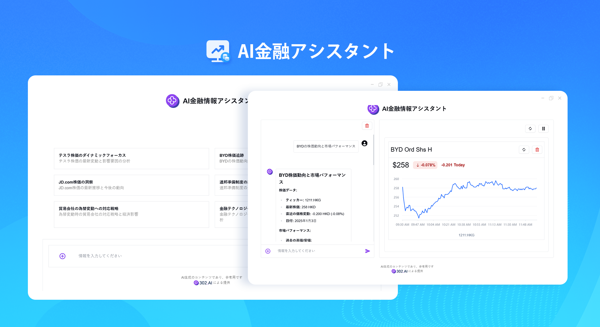

# 
📈 AI 金融情報アシスタント 🚀✨

AI金融アシスタントはAIとチャットすることで、株式ファンドなどのオンライン財経情報を迅速かつ正確に取得し、ユーザーのためにデータと情報をインテリジェントに分析し、グラフを描いて財経の動きを示すことができる。

<a href="README_zh.md">中文</a> | <a href="README.md">English</a> | <a href="README_ja.md">日本語</a>

    

[302.AI](https://302.ai/ja/)の[AI ファイナンシャルアシスタント](https://302.ai/product/detail/48)のオープンソースバージョンです。
302.AIに直接ログインし、ゼロコード、ゼロ設定でオンラインバージョンを使用できます。
または、このプロジェクトを自分のニーズに合わせて修正し、302.AIのAPI KEYを入力して自身でデプロイすることもできます。

## インターフェースプレビュー
トップページに検索したい財経系情報を入力します。

AIと対話する情報に基づいて右側に対応するグラフを生成し、リフレッシュすることでリアルタイムのグラフ情報を取得することができる。

## 📐 プロジェクトの特徴
- インテリジェントクエリ：ユーザーの入力に基づき、AIが最適なツールを自動選択して財務情報を検索します。
- リアルタイム株式市場チャート：取得したデータに基づき、直感的な株式市場トレンドチャートを自動的にレンダリングします。
- ユーザーフレンドリーなインターフェース：シンプルで直感的なユーザーインターフェースで、迅速な検索と情報取得が可能です。

## 🌍 多言語サポート
- 中国語インターフェース
- English Interface
- 日本語インターフェース

## 🚩 将来のアップデート計画
- [ ] 新しい財経ニュースのローテーションバー
- [ ] 新規履歴機能

AI ファイナンシャルアシスタントを通じて、リアルタイムの経済ニュースと正確な株式市場分析を簡単に入手できます。インテリジェントシステムが、パーソナライズされた財務洞察を提供します。🎉💻 AIが駆動する新しいコードの世界を一緒に探索しましょう！🌟🚀

## 🛠️ 技術スタック
フロントエンドフレームワーク：Next.js  
国際化：next-i18next  

## 開発＆デプロイ
1. プロジェクトをクローン `git clone https://github.com/302ai/302_financial_information_assistant`
2. 依存関係をインストール `pnpm install`
3. 302のAPI KEYを設定 (.env.exampleを参照)
4. プロジェクトを実行 `pnpm dev`
5. ビルドとデプロイ `docker build -t financial_information_assistant . && docker run -p 3000:3000 302_financial_information_assistant`

## ✨ 302.AIの紹介 ✨
[302.AI](https://302.ai)は、企業向けAIアプリケーションプラットフォームで、従量課金制、すぐに使える、オープンソースエコシステムを特徴としています。✨
1. 🧠 最新かつ最も包括的なAI機能とブランドを集約しており、言語モデル、画像モデル、音声モデル、ビデオモデルなどが含まれます。
2. 🚀 基盤モデルに基づいて深層アプリケーション開発を行い、単純なチャットボットではなく、真のAI製品を開発しています。
3. 💰 月額料金なし、すべての機能が従量課金制、完全にオープンで、真の意味で参入障壁が低く、上限が高いことを実現しています。
4. 🛠 強力な管理バックエンド、チームと中小企業向けで、1人で管理、多人数で使用できます。
5. 🔗 すべてのAI機能がAPI接続を提供し、すべてのツールがオープンソースでカスタマイズ可能です（進行中）。
6. 💡 強力な開発チームで、毎週2-3の新アプリをリリースし、製品は毎日更新されています。興味のある開発者はぜひご連絡ください。
