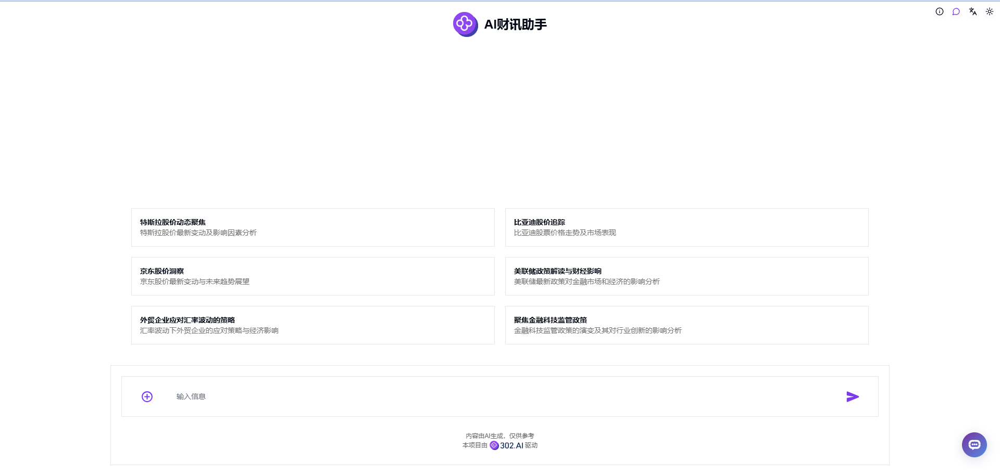

# 
💻 AI 财讯助手 🚀✨

AI 财讯助手利用语言大模型辅助用户轻松获取实时的财经新闻和精准的股市分析。

<a href="README_zh.md">中文</a> | <a href="README.md">English</a> | <a href="README_ja.md">日本語</a>

    

来自[302.AI](https://302.ai)的[AI 财讯助手](https://302.ai/tools/finance/)的开源版本。
你可以直接登录302.AI，零代码零配置使用在线版本。
或者对本项目根据自己的需求进行修改，传入302.AI的API KEY，自行部署。

## 项目特性
- 智能查询 : 基于用户输入，AI 自动选择最适合的工具来查询财经信息。
- 实时股市图表 : 根据查询到的数据，自动渲染直观的股市走势图表。
- 用户友好界面 : 简洁直观的用户界面，便于快速查询和信息获取。
- 多语言支持 : 支持多种语言，满足国际用户的需求。

## 🌍 多语言支持
- 中文界面
- English Interface
- 日本語インターフェース

通过 AI 财讯助手，您可以轻松获取实时的财经新闻和精准的股市分析。智能系统都能为您提供个性化的财经洞察。🎉💻 让我们一起探索AI驱动的代码新世界吧! 🌟🚀

## 🛠️ 技术栈
前端框架: Next.js  
国际化: next-i18next  

## 开发&部署
1. 克隆项目 `git clone https://github.com/302ai/302_financial_information_assistant`
2. 安装依赖 `pnpm install`
3. 配置302的API KEY 参考.env.example
4. 运行项目 `pnpm dev`
5. 打包部署 `docker build -t document-editor . && docker run -p 3000:3000 302_financial_information_assistant`

## ✨ 302.AI介绍 ✨
[302.AI](https://302.ai)是一个面向企业的AI应用平台，按需付费，开箱即用，开源生态。✨
1. 🧠 集合了最新最全的AI能力和品牌，包括但不限于语言模型、图像模型、声音模型、视频模型。
2. 🚀 在基础模型上进行深度应用开发，我们开发真正的AI产品，而不是简单的对话机器人
3. 💰 零月费，所有功能按需付费，全面开放，做到真正的门槛低，上限高。
4. 🛠 功能强大的管理后台，面向团队和中小企业，一人管理，多人使用。
5. 🔗 所有AI能力均提供API接入，所有工具开源可自行定制（进行中）。
6. 💡 强大的开发团队，每周推出2-3个新应用，产品每日更新。有兴趣加入的开发者也欢迎联系我们
